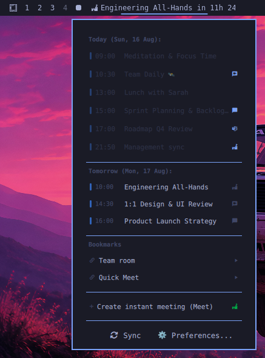
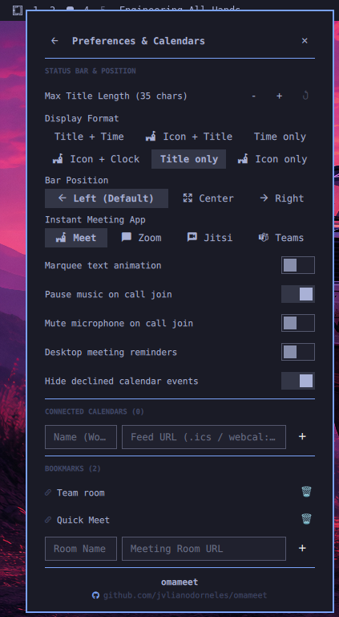

# omameet 📅

> **Universal MeetingBar for Omarchy Quattro** — Track upcoming meetings on your status bar with countdown, get desktop reminders, and join video calls with a single click.

Inspired by [MeetingBar for macOS](https://github.com/leits/MeetingBar), **omameet** brings the same smooth, responsive, and lightweight meeting experience to **Omarchy Linux**.

<p align="center">
  
  
</p>

---

## ✨ Features

- **1-Click Video Call Access (+50 Providers)**:
  - Automatically detects meeting links from: **Google Meet**, **Zoom**, **Microsoft Teams**, **Cisco Webex**, **Jitsi Meet**, **Discord**, **Slack Huddles**, **Skype**, **Whereby**, etc.
  - **Middle-click** the bar widget to instantly join the next upcoming or ongoing meeting in your default browser.
- **Universal Calendar Support**:
  - **Google Calendar**: Direct sync via *Secret address in iCal format* (`.ics`), public URLs, or local exports.
  - **Apple iCloud Calendar**: Native support for `webcal://` URLs, shared calendar links, and CalDAV endpoints.
  - **Microsoft Outlook / Office 365**: Direct sync via published ICS links from Outlook Web.
  - **Nextcloud / Fastmail / CalDAV**: HTTP Basic Auth & App Passwords for standard RFC 4791 CalDAV servers.
  - **Local Files (.ics / directories)**: Live monitoring of local `.ics` files and directories managed by `vdirsyncer` or `khal`.
- **Smart Status Bar Widget**:
  - Shows next meeting with provider icon, start time, and relative countdown (`in 15m`).
  - **Live Meeting Indicator**: Highlights ongoing meetings (`🔴 Sprint Sync (20m left)`).
  - **Configurable Character Limit (`maxTitleLength`)**: Set custom maximum title length on the bar (default: 35).
  - **Marquee Text Animation (`marqueeEnabled`)**: Smooth horizontal scrolling animation for long titles that exceed the character limit.
  - **Display Formats**: Choose from 6 different display formats (Title + Time, Icon + Title, Time only, Icon + Clock, Title only, Icon only).
  - **Bar Position Selector**: Choose widget placement on the top bar (Left, Center, Right). Defaults to the **left** section.
- **Modern Interactive Agenda Dropdown**:
  - **Hero Card**: Highlighted upcoming/active meeting with large countdown, prominent "Join" button, and "Copy Link" button.
  - **Today & Tomorrow Timeline**: Chronological events with source calendar color pills, start times, titles, copy buttons, and video provider icons.
  - **Quick Bookmarks**: Pin recurring team rooms with 1-click access and link copying.
  - **Instant Meeting Launcher**: 1-click ad-hoc room creation for Google Meet, Zoom, Jitsi Meet, or Microsoft Teams.
  - **Calendar Manager**: Add, toggle, and remove multiple calendar feeds with custom color tags.
- **System Automations**:
  - **Auto-Mute on Join (`muteMicOnJoin`)**: Automatically mutes the default system microphone capture device (PipeWire / PulseAudio) when joining a call.
  - **Pause Media on Join (`pauseMusicOnJoin`)**: Pauses Spotify and MPRIS audio playback when entering a meeting.
- **Desktop Notifications**: Native desktop reminders before meetings start with action to join directly.
- **CLI & Hyprland Shortcuts**: Full terminal access and global keybinding integration via the `omameet` CLI.

---

## 🚀 Installation & Setup

### Option 1: Automatic via Omarchy Marketplace
Install directly from the Omarchy Plugin Marketplace:
```bash
omarchy plugin install dorneles.omameet
```

### Option 2: Manual Installation via Git
```bash
# 1. Clone into your Omarchy plugins directory
git clone https://github.com/jvlianodorneles/omameet.git ~/.config/omarchy/plugins/dorneles.omameet

# 2. Run the setup script to link the CLI and set permissions
~/.config/omarchy/plugins/dorneles.omameet/install.sh

# 3. Reload Omarchy shell
omarchy restart shell
```

The plugin will automatically mount on the **left** section of your top bar. You can change its position at any time in the settings window or by running:
```bash
omameet set-section center   # or: left / right
```

---

## 🗑️ Uninstallation & Removal

To completely remove **omameet** from your system:

### Option 1: Quick Uninstall Script
```bash
~/.config/omarchy/plugins/dorneles.omameet/uninstall.sh
```

### Option 2: Manual Removal Steps
```bash
# 1. Remove the plugin source directory
rm -rf ~/.config/omarchy/plugins/dorneles.omameet

# 2. Remove state, cache, and saved feeds
rm -rf ~/.local/state/omarchy/omameet

# 3. Remove the CLI symlink
rm -f ~/.local/bin/omameet

# 4. Remove widget entry from ~/.config/omarchy/shell.json layout
# (Remove {"id": "dorneles.omameet"} from bar.layout.left / center / right)

# 5. Restart Omarchy Shell to apply changes
omarchy restart shell
```

---

## 📅 How to Connect Your Calendars

### 🔹 Google Calendar
1. Open [Google Calendar](https://calendar.google.com/) in your browser.
2. In the left sidebar, click the **three dots (...)** next to your calendar > **Settings and sharing**.
3. Scroll down to the **Integrate calendar** section.
4. Copy the link in the **Secret address in iCal format** field.
5. Open the `omameet` popup > **Preferences & Calendars (⚙)** > paste the URL under **Connected Calendars** and click **+**.

### 🔹 Microsoft Outlook / Office 365
1. Open [Outlook Web](https://outlook.office.com/) > click the **Settings** gear icon.
2. Navigate to **Calendar** > **Shared calendars**.
3. Under **Publish a calendar**, select your calendar, choose permissions, and click **Publish**.
4. Copy the published `.ics` URL and add it in `omameet`.

### 🔹 Apple iCloud Calendar
1. In the macOS Calendar app or at [iCloud.com](https://www.icloud.com/calendar), click the share icon next to your calendar.
2. Enable **Public Calendar** (or copy the `webcal://...` link).
3. Paste the URL into `omameet`.

---

## ⌨️ CLI Commands (`omameet`)

```bash
# Sync all calendar feeds immediately
omameet sync

# Join current or next upcoming meeting with 1 command
omameet join

# Copy meeting link to clipboard
omameet copy-link

# Mute system microphone
omameet mute-mic

# Display next meeting details
omameet next

# List today's and tomorrow's agenda in terminal
omameet list

# Add a calendar feed via terminal
omameet add-feed "Work" "https://calendar.google.com/.../basic.ics" "#10B981"

# Create an instant ad-hoc meeting
omameet create google   # or: omameet create zoom / jitsi / teams

# Get or change top bar widget position
omameet get-section
omameet set-section left  # or: center / right

# Run background notification check
omameet notify-check
```

---

## 💡 Recommended Hyprland Keybindings

Add these lines to `~/.config/hypr/bindings.lua`:

```lua
-- Join next meeting with Super + Alt + M
o.bind("$mainMod ALT, M", function() hl.exec("omameet join") end)

-- Copy next meeting link with Super + Alt + C
o.bind("$mainMod ALT, C", function() hl.exec("omameet copy-link") end)

-- Toggle agenda popup with Super + Alt + A
o.bind("$mainMod ALT, A", function() hl.exec("omarchy-shell shell toggle dorneles.omameet") end)
```

---

## 🛠️ Configuration Options

In `~/.config/omarchy/shell.json` (or via the interactive Omarchy preferences panel):

| Option | Type | Default | Description |
| :--- | :--- | :--- | :--- |
| `format` | `enum` | `"title_countdown"` | Text display format (`title_countdown`, `icon_title_countdown`, `countdown_only`, `icon_time`, `title_only`, `icon_only`) |
| `maxTitleLength` | `int` | `35` | Maximum title character limit on the status bar |
| `marqueeEnabled` | `bool` | `false` | Enable smooth marquee scrolling when title exceeds character limit |
| `defaultInstantMeetingProvider` | `enum` | `"google"` | Preferred service for instant ad-hoc meetings (`google`, `zoom`, `jitsi`, `teams`) |
| `pauseMusicOnJoin` | `bool` | `true` | Automatically pause Spotify/MPRIS media players when joining a call |
| `muteMicOnJoin` | `bool` | `false` | Automatically mute default microphone capture device when joining a call |
| `hideDeclined` | `bool` | `true` | Filter out declined or cancelled calendar events |
| `refreshIntervalMin` | `int` | `15` | Automatic background calendar sync interval in minutes |
| `urgentThresholdMin` | `int` | `5` | Minutes before meeting start for urgent highlight on the bar |
| `enableNotifications` | `bool` | `true` | Send desktop notifications before meetings start |
| `notificationLeadMin` | `int` | `5` | Minutes before meeting start to send desktop reminder |
| `hideAllDayEvents` | `bool` | `false` | Hide all-day calendar events |
| `hideWithoutLinks` | `bool` | `false` | Only show events that contain a video meeting link |

---

## 📄 License

Distributed under the MIT License. See [LICENSE](LICENSE) for details.
